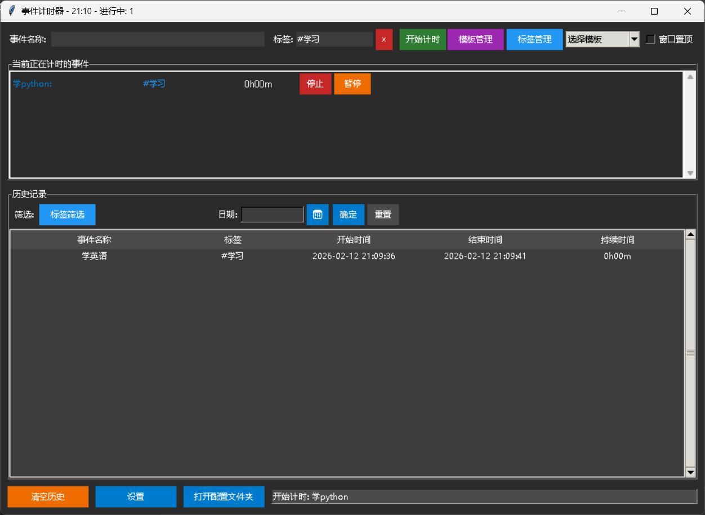
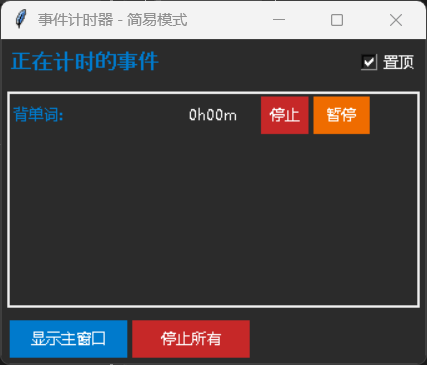
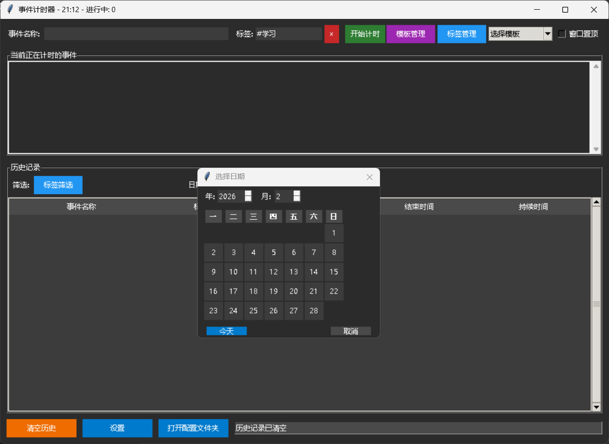
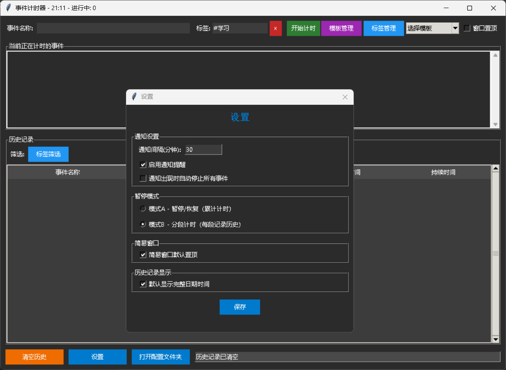

# Event Timer

[🇨🇳 中文](https://readme.zh.md/) | [🇬🇧 English](https://readme.md/)

A feature-rich desktop timing tool that supports concurrent timing of multiple events, tag management, template execution, history filtering, system tray, customizable notification intervals, and two pause modes. Ideal for scenarios requiring precise recording of task durations.

---

## ✨ Features

- **Multiple events simultaneously** – Start multiple events at the same time, each independently timed and controlled.
    
- **Tag system** – Add tags to events, manage tags, view tag frequency, multi‑select filter in history.
    
- **Templates** – Create event templates, start a sequence of events with one click, automatically continue to the next event.
    
- **Pause modes**
    
    - **Mode A** – Normal pause/resume, total time accumulates (recommended).
        
    - **Mode B** – Segmented timing: each pause saves the current segment as a history entry; resuming creates a new event with the same name, total time keeps accumulating.  
        Switch freely in Settings.
        
- **History**
    
    - Fully record event name, tags, start/end time, duration.
        
    - Filter by multiple tags, filter by a specific date.
        
    - Click column headers to toggle time display format (time only / full datetime).
        
    - Right‑click context menu: delete single entry, edit tags.
        
- **Simple window** – Automatically appears when the main window is hidden, displays ongoing events, supports pause/resume/stop, can be set always‑on‑top.
    
- **System tray** – Minimize to tray; tray menu can show the main window or the simple window separately.
    
- **Notification reminder** – Popup reminder when an event has been running for a user‑defined number of minutes, with option to auto‑stop events.
    
- **Theme adaptation** – Automatically detects Windows / macOS system dark/light mode and applies matching color scheme.
    
- **Persistent storage** – All data (history, tags, templates, settings) is automatically saved in a `config` folder next to the executable/script, easy to backup or migrate.
    
- **One‑click packaging** – Ready to be packaged with PyInstaller as a standalone .exe; config folder remains next to the exe.
    

---

## 📥 Installation & Running

### 1. Requirements

- Python 3.7 or higher
    
- OS: Windows 10/11, macOS, Linux (with system tray support)
    

### 2. Clone the repository

bash

git clone https://github.com/EathanAAA/event-timer.git
cd event-timer

### 3. Install dependencies

bash

pip install pillow pystray

_Note: On Linux, `pystray` may require additional system packages; please refer to its official documentation._

### 4. Run the program

bash

python event_timer.py

---

## 🎯 User Guide

### Main Window Overview

- **Top**: Event name input, tag input (× button clears all tags), **Start** button.
    
- **Top‑right**: Template Management, Tag Management, quick template dropdown, **Window on Top** checkbox.
    
- **Middle**: List of currently running events – each displays name, tags, duration, and provides **Pause/Resume** and **Stop** buttons.
    
- **Bottom**: History table with filter toolbar; buttons: **Clear History**, **Settings**, **Open Config Folder**.
    

### ⏱️ Basic Operations

1. **Start timing** – Enter an event name, optionally add tags (separated by commas or spaces, e.g., `#work #coding`), click **Start**.
    
2. **Pause/Resume** – Click the **Pause** button on an event (mode‑dependent); click **Resume** to continue.
    
3. **Stop an event** – Click **Stop**; the event ends and is saved to history.
    
4. **Filter history** – Click **Tag Filter** to multi‑select tags; enter a date in `YYYY-MM-DD` format or click the 📅 button to pick a date, then click **Apply**.
    
5. **Use templates** – Create templates in **Template Management**, save them, then select a template from the dropdown – its events will start automatically one after another.
    

### ⚙️ Settings Window

Access via the **Settings** button at the bottom. Here you can configure:

- Notification interval (minutes), enable/disable notifications, auto‑stop events on notification.
    
- Pause mode (A / B).
    
- Whether the Simple Window is always‑on‑top by default.
    
- Whether history displays full datetime by default.
    

---

## 📁 Data Storage

All data files are stored in a **`config` folder inside the program directory**:

|File|Purpose|
|---|---|
|`events_history.json`|Historical records|
|`event_names.json`|Event name usage frequency (for input auto‑completion)|
|`event_tags.json`|Tag usage frequency|
|`event_templates.json`|User‑created templates|
|`settings.json`|Notification interval, pause mode, etc.|

**Backup / migration**: simply copy the entire `config` folder.

---

## 🚀 Packaging as a Standalone EXE (Windows)

1. Install PyInstaller:
    

bash

pip install pyinstaller

2. In the program directory, run:
    

bash

pyinstaller --onefile --windowed --icon=timer_icon.ico --name=EventTimer event_timer.py

_If you don't have an icon file, omit the `--icon` argument._

3. The packaged `EventTimer.exe` will be in the `dist` folder. When executed, a `config` folder is automatically created next to the exe.
    

---

## ❓ Frequently Asked Questions

**Q: The date entry in history cannot be clicked?**  
A: This has been fixed by forcing the entry to be enabled and adding a 📅 calendar button. Please ensure you are using the latest code.

**Q: The simple window does not appear?**  
A: It will pop up automatically when the main window is hidden **and** at least one event is running. You can also open it manually via the tray menu: **Show Simple Window**.

**Q: How to completely exit the program?**  
A: Right‑click the tray icon → **Exit**, or close the main window (which only minimizes) → tray menu → **Exit**.

---

## 🤝 Contributing

Issues and pull requests are welcome.  
Before submitting, please ensure your code style matches the existing codebase and update the documentation accordingly.

---

## 📄 License

This project is licensed under the **MIT License** – you are free to use, modify, and distribute it, provided that the original copyright notice is included.

---

## ✨ Acknowledgements

Thanks to all users who provided feedback and helped make this tool better.  
If you like this project, please give it a ⭐ Star on GitHub!

---

    <em>Main Window</em> 

    <em>Simple Window (always on top)</em> 

    <em>Calendar Date Picker</em> 

    <em>settings</em> 

